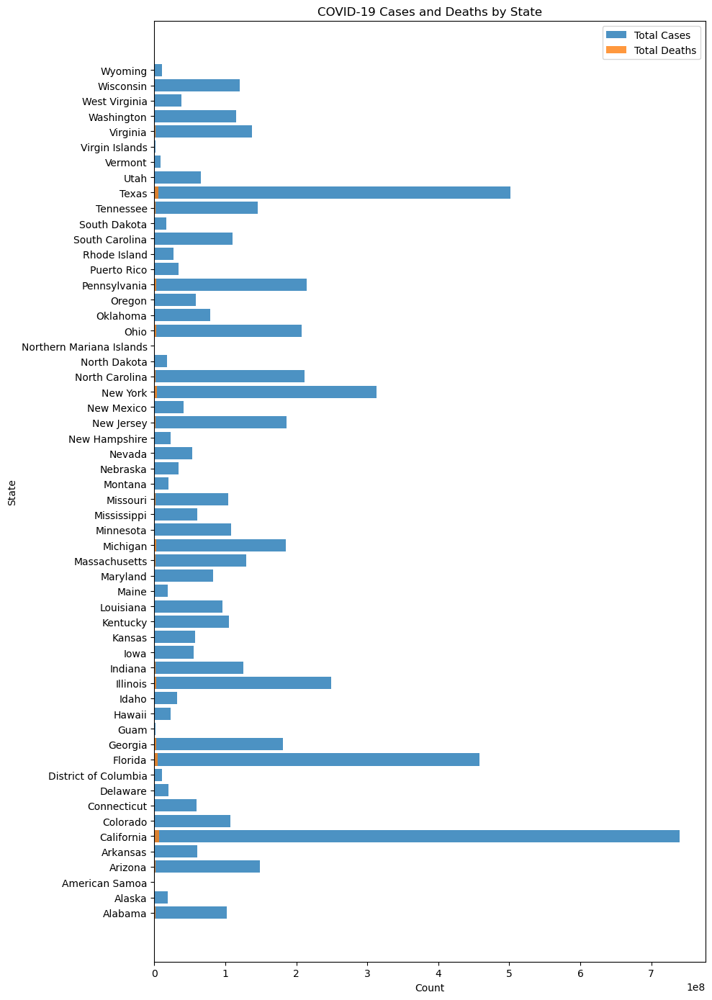

```python
#install sqlite
pip install sqlite-database

```

    Collecting sqlite-database
      Downloading sqlite_database-0.6.8-py3-none-any.whl.metadata (4.2 kB)
    Downloading sqlite_database-0.6.8-py3-none-any.whl (35 kB)
    Installing collected packages: sqlite-database
    Successfully installed sqlite-database-0.6.8
    Note: you may need to restart the kernel to use updated packages.


```python
#import libraries
import sqlite3
import csv
import numpy as np
import pandas as pd
```

syntax: sqlite3.connect(database, timeout=5.0, detect_types=0, isolation_level='DEFERRED', check_same_thread=True, factory=sqlite3.Connection, cached_statements=128, uri=False,*, autocommit=sqlite3.LEGACY_TRANSACTION_CONTROL)


```python
df_covid = pd.read_csv('/Users/bayowaonabajo/Downloads/archive-4/us-counties-recent.csv')
df_covid.head()
```


<div>
<style scoped>
    .dataframe tbody tr th:only-of-type {
        vertical-align: middle;
    }

    .dataframe tbody tr th {
        vertical-align: top;
    }

    .dataframe thead th {
        text-align: right;
    }
</style>
<table border="1" class="dataframe">
  <thead>
    <tr style="text-align: right;">
      <th></th>
      <th>date</th>
      <th>county</th>
      <th>state</th>
      <th>fips</th>
      <th>cases</th>
      <th>deaths</th>
    </tr>
  </thead>
  <tbody>
    <tr>
      <th>0</th>
      <td>2023-02-22</td>
      <td>Autauga</td>
      <td>Alabama</td>
      <td>1001.0</td>
      <td>19732</td>
      <td>230.0</td>
    </tr>
    <tr>
      <th>1</th>
      <td>2023-02-22</td>
      <td>Baldwin</td>
      <td>Alabama</td>
      <td>1003.0</td>
      <td>69641</td>
      <td>724.0</td>
    </tr>
    <tr>
      <th>2</th>
      <td>2023-02-22</td>
      <td>Barbour</td>
      <td>Alabama</td>
      <td>1005.0</td>
      <td>7451</td>
      <td>112.0</td>
    </tr>
    <tr>
      <th>3</th>
      <td>2023-02-22</td>
      <td>Bibb</td>
      <td>Alabama</td>
      <td>1007.0</td>
      <td>8067</td>
      <td>109.0</td>
    </tr>
    <tr>
      <th>4</th>
      <td>2023-02-22</td>
      <td>Blount</td>
      <td>Alabama</td>
      <td>1009.0</td>
      <td>18616</td>
      <td>261.0</td>
    </tr>
  </tbody>
</table>
</div>


```python

# Create a connection and db
# Syntax: conn = sqlite3.connect('databaseName.sqlite')
conn = sqlite3.connect('us_covid_recent_counties.db')

# Create a cursor object to navigate
cur = conn.cursor()
```

None is NULL
int is INTEGER
float is REAL
str is TEXT
bytes is BLOB

CREATE TABLE students(
name TEXT, 
age INTEGER,
grade INTEGER
);


```python
# Create a cursor to interact with the database.
cur.execute('''DROP TABLE covid_data_''')
```


    <sqlite3.Cursor at 0x10791d540>


```python
cur.execute( '''CREATE TABLE covid_data_ (
        id INTEGER PRIMARY KEY AUTOINCREMENT,
        date TEXT,
        county TEXT,
        state TEXT,
        fips INTEGER,
        cases INTEGER,
        deaths REAL,
        country TEXT,
        year INTEGER
    )
''')
```


    <sqlite3.Cursor at 0x10791d540>


```python
# utilizing the ny-times covid dataset showing covid case and death counts for U.S. counties 
data = "/Users/bayowaonabajo/Downloads/archive-4/us-counties-recent.csv"

# Open the file and read the data
with open(data, 'r') as csv_file:
    csv_reader = csv.reader(csv_file)
    next(csv_reader)  # Skip the header row

    for row in csv_reader:
        date = row[0]
        county = row[1]
        state = row[2]
        fips_str = row[3]
        deaths_str = row[5]  

        # Check if fips is empty
        if fips_str == '':
            continue  # Skip row

        # Check if empty
        if deaths_str == '':
            continue  # Skip row

        fips = int(fips_str)
        cases = int(row[4])
        deaths = float(deaths_str)
        
        country = "U.S.A"
        
        year = int(date.split('-')[0])
        
        cur.execute('''
            INSERT INTO covid_data_ (date, county, state, fips, cases, deaths, country, year)
            VALUES (?, ?, ?, ?, ?, ?, ?, ?)
        ''', (date, county, state, fips, cases, deaths, country, year))

    conn.commit()


```


```python
# Load dataFrame data into a SQLite Table
df_covid.to_sql('covid_data_', conn, if_exists='append', index=False)
```


    97701


```python
cur.execute('''
SELECT *
FROM covid_data_;''')

Nycoviddata = pd.DataFrame(cur.fetchall())
Nycoviddata.head()
```


<div>
<style scoped>
    .dataframe tbody tr th:only-of-type {
        vertical-align: middle;
    }

    .dataframe tbody tr th {
        vertical-align: top;
    }

    .dataframe thead th {
        text-align: right;
    }
</style>
<table border="1" class="dataframe">
  <thead>
    <tr style="text-align: right;">
      <th></th>
      <th>0</th>
      <th>1</th>
      <th>2</th>
      <th>3</th>
      <th>4</th>
      <th>5</th>
      <th>6</th>
      <th>7</th>
      <th>8</th>
    </tr>
  </thead>
  <tbody>
    <tr>
      <th>0</th>
      <td>1</td>
      <td>2023-02-22</td>
      <td>Autauga</td>
      <td>Alabama</td>
      <td>1001</td>
      <td>19732</td>
      <td>230.0</td>
      <td>U.S.A</td>
      <td>2023</td>
    </tr>
    <tr>
      <th>1</th>
      <td>2</td>
      <td>2023-02-22</td>
      <td>Baldwin</td>
      <td>Alabama</td>
      <td>1003</td>
      <td>69641</td>
      <td>724.0</td>
      <td>U.S.A</td>
      <td>2023</td>
    </tr>
    <tr>
      <th>2</th>
      <td>3</td>
      <td>2023-02-22</td>
      <td>Barbour</td>
      <td>Alabama</td>
      <td>1005</td>
      <td>7451</td>
      <td>112.0</td>
      <td>U.S.A</td>
      <td>2023</td>
    </tr>
    <tr>
      <th>3</th>
      <td>4</td>
      <td>2023-02-22</td>
      <td>Bibb</td>
      <td>Alabama</td>
      <td>1007</td>
      <td>8067</td>
      <td>109.0</td>
      <td>U.S.A</td>
      <td>2023</td>
    </tr>
    <tr>
      <th>4</th>
      <td>5</td>
      <td>2023-02-22</td>
      <td>Blount</td>
      <td>Alabama</td>
      <td>1009</td>
      <td>18616</td>
      <td>261.0</td>
      <td>U.S.A</td>
      <td>2023</td>
    </tr>
  </tbody>
</table>
</div>


```python
#First two states in the database
cur.execute('''
SELECT DISTINCT state
     FROM covid_data_
     ORDER BY state ASC
     LIMIT 2;
''')

cur.fetchall()
```


    [('Alabama',), ('Alaska',)]


```python
#Last two states in the database
cur.execute('''
SELECT DISTINCT state
     FROM covid_data_
     ORDER BY state DESC
     LIMIT 2;
''')

cur.fetchall()


```


    [('Wyoming',), ('Wisconsin',)]


```python
cur.execute('''
SELECT *
    FROM covid_data_
    WHERE fips BETWEEN 1001.0 AND 1002.0;
''')

cur.fetchall()
```


    [(1, '2023-02-22', 'Autauga', 'Alabama', 1001, 19732, 230.0, 'U.S.A', 2023),
     (3143, '2023-02-23', 'Autauga', 'Alabama', 1001, 19732, 230.0, 'U.S.A', 2023),
     (6285, '2023-02-24', 'Autauga', 'Alabama', 1001, 19732, 230.0, 'U.S.A', 2023),
     (9427, '2023-02-25', 'Autauga', 'Alabama', 1001, 19732, 230.0, 'U.S.A', 2023),
     (12569,
      '2023-02-26',
      'Autauga',
      'Alabama',
      1001,
      19732,
      230.0,
      'U.S.A',
      2023),
     (15711,
      '2023-02-27',
      'Autauga',
      'Alabama',
      1001,
      19732,
      230.0,
      'U.S.A',
      2023),
     (18853,
      '2023-02-28',
      'Autauga',
      'Alabama',
      1001,
      19732,
      230.0,
      'U.S.A',
      2023),
     (21995,
      '2023-03-01',
      'Autauga',
      'Alabama',
      1001,
      19759,
      232.0,
      'U.S.A',
      2023),
     (25137,
      '2023-03-02',
      'Autauga',
      'Alabama',
      1001,
      19759,
      232.0,
      'U.S.A',
      2023),
     (28279,
      '2023-03-03',
      'Autauga',
      'Alabama',
      1001,
      19759,
      232.0,
      'U.S.A',
      2023),
     (31421,
      '2023-03-04',
      'Autauga',
      'Alabama',
      1001,
      19759,
      232.0,
      'U.S.A',
      2023),
     (34563,
      '2023-03-05',
      'Autauga',
      'Alabama',
      1001,
      19759,
      232.0,
      'U.S.A',
      2023),
     (37705,
      '2023-03-06',
      'Autauga',
      'Alabama',
      1001,
      19759,
      232.0,
      'U.S.A',
      2023),
     (40847,
      '2023-03-07',
      'Autauga',
      'Alabama',
      1001,
      19759,
      232.0,
      'U.S.A',
      2023),
     (43989,
      '2023-03-08',
      'Autauga',
      'Alabama',
      1001,
      19790,
      232.0,
      'U.S.A',
      2023),
     (47131,
      '2023-03-09',
      'Autauga',
      'Alabama',
      1001,
      19790,
      232.0,
      'U.S.A',
      2023),
     (50273,
      '2023-03-10',
      'Autauga',
      'Alabama',
      1001,
      19790,
      232.0,
      'U.S.A',
      2023),
     (53415,
      '2023-03-11',
      'Autauga',
      'Alabama',
      1001,
      19790,
      232.0,
      'U.S.A',
      2023),
     (56557,
      '2023-03-12',
      'Autauga',
      'Alabama',
      1001,
      19790,
      232.0,
      'U.S.A',
      2023),
     (59699,
      '2023-03-13',
      'Autauga',
      'Alabama',
      1001,
      19790,
      232.0,
      'U.S.A',
      2023),
     (62841,
      '2023-03-14',
      'Autauga',
      'Alabama',
      1001,
      19790,
      232.0,
      'U.S.A',
      2023),
     (65983,
      '2023-03-15',
      'Autauga',
      'Alabama',
      1001,
      19799,
      234.0,
      'U.S.A',
      2023),
     (69125,
      '2023-03-16',
      'Autauga',
      'Alabama',
      1001,
      19799,
      234.0,
      'U.S.A',
      2023),
     (72267,
      '2023-03-17',
      'Autauga',
      'Alabama',
      1001,
      19799,
      234.0,
      'U.S.A',
      2023),
     (75409,
      '2023-03-18',
      'Autauga',
      'Alabama',
      1001,
      19799,
      234.0,
      'U.S.A',
      2023),
     (78551,
      '2023-03-19',
      'Autauga',
      'Alabama',
      1001,
      19799,
      234.0,
      'U.S.A',
      2023),
     (81693,
      '2023-03-20',
      'Autauga',
      'Alabama',
      1001,
      19799,
      234.0,
      'U.S.A',
      2023),
     (84835,
      '2023-03-21',
      'Autauga',
      'Alabama',
      1001,
      19799,
      234.0,
      'U.S.A',
      2023),
     (87977,
      '2023-03-22',
      'Autauga',
      'Alabama',
      1001,
      19812,
      235.0,
      'U.S.A',
      2023),
     (91119,
      '2023-03-23',
      'Autauga',
      'Alabama',
      1001,
      19812,
      235.0,
      'U.S.A',
      2023),
     (94261, '2023-02-22', 'Autauga', 'Alabama', 1001, 19732, 230.0, None, None),
     (97520, '2023-02-23', 'Autauga', 'Alabama', 1001, 19732, 230.0, None, None),
     (100779, '2023-02-24', 'Autauga', 'Alabama', 1001, 19732, 230.0, None, None),
     (104038, '2023-02-25', 'Autauga', 'Alabama', 1001, 19732, 230.0, None, None),
     (107297, '2023-02-26', 'Autauga', 'Alabama', 1001, 19732, 230.0, None, None),
     (110555, '2023-02-27', 'Autauga', 'Alabama', 1001, 19732, 230.0, None, None),
     (113813, '2023-02-28', 'Autauga', 'Alabama', 1001, 19732, 230.0, None, None),
     (117069, '2023-03-01', 'Autauga', 'Alabama', 1001, 19759, 232.0, None, None),
     (120326, '2023-03-02', 'Autauga', 'Alabama', 1001, 19759, 232.0, None, None),
     (123583, '2023-03-03', 'Autauga', 'Alabama', 1001, 19759, 232.0, None, None),
     (126839, '2023-03-04', 'Autauga', 'Alabama', 1001, 19759, 232.0, None, None),
     (130095, '2023-03-05', 'Autauga', 'Alabama', 1001, 19759, 232.0, None, None),
     (133350, '2023-03-06', 'Autauga', 'Alabama', 1001, 19759, 232.0, None, None),
     (136605, '2023-03-07', 'Autauga', 'Alabama', 1001, 19759, 232.0, None, None),
     (139861, '2023-03-08', 'Autauga', 'Alabama', 1001, 19790, 232.0, None, None),
     (143117, '2023-03-09', 'Autauga', 'Alabama', 1001, 19790, 232.0, None, None),
     (146372, '2023-03-10', 'Autauga', 'Alabama', 1001, 19790, 232.0, None, None),
     (149627, '2023-03-11', 'Autauga', 'Alabama', 1001, 19790, 232.0, None, None),
     (152882, '2023-03-12', 'Autauga', 'Alabama', 1001, 19790, 232.0, None, None),
     (156136, '2023-03-13', 'Autauga', 'Alabama', 1001, 19790, 232.0, None, None),
     (159391, '2023-03-14', 'Autauga', 'Alabama', 1001, 19790, 232.0, None, None),
     (162646, '2023-03-15', 'Autauga', 'Alabama', 1001, 19799, 234.0, None, None),
     (165905, '2023-03-16', 'Autauga', 'Alabama', 1001, 19799, 234.0, None, None),
     (169163, '2023-03-17', 'Autauga', 'Alabama', 1001, 19799, 234.0, None, None),
     (172421, '2023-03-18', 'Autauga', 'Alabama', 1001, 19799, 234.0, None, None),
     (175679, '2023-03-19', 'Autauga', 'Alabama', 1001, 19799, 234.0, None, None),
     (178936, '2023-03-20', 'Autauga', 'Alabama', 1001, 19799, 234.0, None, None),
     (182192, '2023-03-21', 'Autauga', 'Alabama', 1001, 19799, 234.0, None, None),
     (185447, '2023-03-22', 'Autauga', 'Alabama', 1001, 19812, 235.0, None, None),
     (188705, '2023-03-23', 'Autauga', 'Alabama', 1001, 19812, 235.0, None, None)]


```python
cur.execute('''
DELETE 
FROM covid_data_ WHERE id > 15;
''')

cur.execute('''
SELECT *
FROM covid_data_;
''')

cur.fetchall()
```


    [(1, '2023-02-22', 'Autauga', 'Alabama', 1001, 19732, 230.0, 'U.S.A', 2023),
     (2, '2023-02-22', 'Baldwin', 'Alabama', 1003, 69641, 724.0, 'U.S.A', 2023),
     (3, '2023-02-22', 'Barbour', 'Alabama', 1005, 7451, 112.0, 'U.S.A', 2023),
     (4, '2023-02-22', 'Bibb', 'Alabama', 1007, 8067, 109.0, 'U.S.A', 2023),
     (5, '2023-02-22', 'Blount', 'Alabama', 1009, 18616, 261.0, 'U.S.A', 2023),
     (6, '2023-02-22', 'Bullock', 'Alabama', 1011, 3020, 54.0, 'U.S.A', 2023),
     (7, '2023-02-22', 'Butler', 'Alabama', 1013, 6518, 132.0, 'U.S.A', 2023),
     (8, '2023-02-22', 'Calhoun', 'Alabama', 1015, 41228, 675.0, 'U.S.A', 2023),
     (9, '2023-02-22', 'Chambers', 'Alabama', 1017, 10812, 176.0, 'U.S.A', 2023),
     (10, '2023-02-22', 'Cherokee', 'Alabama', 1019, 6732, 134.0, 'U.S.A', 2023),
     (11, '2023-02-22', 'Chilton', 'Alabama', 1021, 12956, 225.0, 'U.S.A', 2023),
     (12, '2023-02-22', 'Choctaw', 'Alabama', 1023, 2255, 63.0, 'U.S.A', 2023),
     (13, '2023-02-22', 'Clarke', 'Alabama', 1025, 8529, 114.0, 'U.S.A', 2023),
     (14, '2023-02-22', 'Clay', 'Alabama', 1027, 5134, 92.0, 'U.S.A', 2023),
     (15, '2023-02-22', 'Cleburne', 'Alabama', 1029, 4393, 74.0, 'U.S.A', 2023)]


```python
#Earliest and Latest record date

cur.execute("SELECT MIN(date) AS earliest_date FROM covid_data_;")
earliest_date = cur.fetchall()
print("Earliest date:", earliest_date)


cur.execute("SELECT MAX(date) AS latest_date FROM covid_data_;")
latest_date = cur.fetchall()
print("Latest date:", latest_date)
```

    Earliest date: [('2023-02-22',)]
    Latest date: [('2023-03-23',)]


```python
# SELECT first 100 rows
cur.execute('''
SELECT *
    FROM covid_data_ 
    LIMIT 20;
''')

cur.fetchall()
```


    [(1, '2023-02-22', 'Autauga', 'Alabama', 1001, 19732, 230.0, 'U.S.A', 2023),
     (2, '2023-02-22', 'Baldwin', 'Alabama', 1003, 69641, 724.0, 'U.S.A', 2023),
     (3, '2023-02-22', 'Barbour', 'Alabama', 1005, 7451, 112.0, 'U.S.A', 2023),
     (4, '2023-02-22', 'Bibb', 'Alabama', 1007, 8067, 109.0, 'U.S.A', 2023),
     (5, '2023-02-22', 'Blount', 'Alabama', 1009, 18616, 261.0, 'U.S.A', 2023),
     (6, '2023-02-22', 'Bullock', 'Alabama', 1011, 3020, 54.0, 'U.S.A', 2023),
     (7, '2023-02-22', 'Butler', 'Alabama', 1013, 6518, 132.0, 'U.S.A', 2023),
     (8, '2023-02-22', 'Calhoun', 'Alabama', 1015, 41228, 675.0, 'U.S.A', 2023),
     (9, '2023-02-22', 'Chambers', 'Alabama', 1017, 10812, 176.0, 'U.S.A', 2023),
     (10, '2023-02-22', 'Cherokee', 'Alabama', 1019, 6732, 134.0, 'U.S.A', 2023),
     (11, '2023-02-22', 'Chilton', 'Alabama', 1021, 12956, 225.0, 'U.S.A', 2023),
     (12, '2023-02-22', 'Choctaw', 'Alabama', 1023, 2255, 63.0, 'U.S.A', 2023),
     (13, '2023-02-22', 'Clarke', 'Alabama', 1025, 8529, 114.0, 'U.S.A', 2023),
     (14, '2023-02-22', 'Clay', 'Alabama', 1027, 5134, 92.0, 'U.S.A', 2023),
     (15, '2023-02-22', 'Cleburne', 'Alabama', 1029, 4393, 74.0, 'U.S.A', 2023)]


```python
# Select variables specific for date "2023-03-23"
cur.execute('''
SELECT *
    FROM covid_data_
    WHERE 2023-03-23;
''')

cur.fetchall()
```


    [(1, '2023-02-22', 'Autauga', 'Alabama', 1001, 19732, 230.0, 'U.S.A', 2023),
     (2, '2023-02-22', 'Baldwin', 'Alabama', 1003, 69641, 724.0, 'U.S.A', 2023),
     (3, '2023-02-22', 'Barbour', 'Alabama', 1005, 7451, 112.0, 'U.S.A', 2023),
     (4, '2023-02-22', 'Bibb', 'Alabama', 1007, 8067, 109.0, 'U.S.A', 2023),
     (5, '2023-02-22', 'Blount', 'Alabama', 1009, 18616, 261.0, 'U.S.A', 2023),
     (6, '2023-02-22', 'Bullock', 'Alabama', 1011, 3020, 54.0, 'U.S.A', 2023),
     (7, '2023-02-22', 'Butler', 'Alabama', 1013, 6518, 132.0, 'U.S.A', 2023),
     (8, '2023-02-22', 'Calhoun', 'Alabama', 1015, 41228, 675.0, 'U.S.A', 2023),
     (9, '2023-02-22', 'Chambers', 'Alabama', 1017, 10812, 176.0, 'U.S.A', 2023),
     (10, '2023-02-22', 'Cherokee', 'Alabama', 1019, 6732, 134.0, 'U.S.A', 2023),
     (11, '2023-02-22', 'Chilton', 'Alabama', 1021, 12956, 225.0, 'U.S.A', 2023),
     (12, '2023-02-22', 'Choctaw', 'Alabama', 1023, 2255, 63.0, 'U.S.A', 2023),
     (13, '2023-02-22', 'Clarke', 'Alabama', 1025, 8529, 114.0, 'U.S.A', 2023),
     (14, '2023-02-22', 'Clay', 'Alabama', 1027, 5134, 92.0, 'U.S.A', 2023),
     (15, '2023-02-22', 'Cleburne', 'Alabama', 1029, 4393, 74.0, 'U.S.A', 2023)]


```python
# select county cases for Alabama and Alaska
cur.execute('''
SELECT county, cases, state
     FROM covid_data_
     WHERE state IN ('Alabama', 'Alaska');
''')

cur.fetchall()

```


    [('Autauga', 19732, 'Alabama'),
     ('Baldwin', 69641, 'Alabama'),
     ('Barbour', 7451, 'Alabama'),
     ('Bibb', 8067, 'Alabama'),
     ('Blount', 18616, 'Alabama'),
     ('Bullock', 3020, 'Alabama'),
     ('Butler', 6518, 'Alabama'),
     ('Calhoun', 41228, 'Alabama'),
     ('Chambers', 10812, 'Alabama'),
     ('Cherokee', 6732, 'Alabama'),
     ('Chilton', 12956, 'Alabama'),
     ('Choctaw', 2255, 'Alabama'),
     ('Clarke', 8529, 'Alabama'),
     ('Clay', 5134, 'Alabama'),
     ('Cleburne', 4393, 'Alabama'),
     ('Coffee', 17094, 'Alabama'),
     ('Colbert', 21197, 'Alabama'),
     ('Conecuh', 3589, 'Alabama'),
     ('Coosa', 3755, 'Alabama'),
     ('Covington', 11765, 'Alabama'),
     ('Crenshaw', 4730, 'Alabama'),
     ('Cullman', 31438, 'Alabama'),
     ('Dale', 16436, 'Alabama'),
     ('Dallas', 10935, 'Alabama'),
     ('DeKalb', 22466, 'Alabama'),
     ('Elmore', 29745, 'Alabama'),
     ('Escambia', 12347, 'Alabama'),
     ('Etowah', 34137, 'Alabama'),
     ('Fayette', 5871, 'Alabama'),
     ('Franklin', 11996, 'Alabama'),
     ('Geneva', 7907, 'Alabama'),
     ('Greene', 2292, 'Alabama'),
     ('Hale', 5705, 'Alabama'),
     ('Henry', 5837, 'Alabama'),
     ('Houston', 32514, 'Alabama'),
     ('Jackson', 18311, 'Alabama'),
     ('Jefferson', 237792, 'Alabama'),
     ('Lamar', 4716, 'Alabama'),
     ('Lauderdale', 30323, 'Alabama'),
     ('Lawrence', 9368, 'Alabama'),
     ('Lee', 47500, 'Alabama'),
     ('Limestone', 32058, 'Alabama'),
     ('Lowndes', 3358, 'Alabama'),
     ('Macon', 5267, 'Alabama'),
     ('Madison', 115627, 'Alabama'),
     ('Marengo', 6078, 'Alabama'),
     ('Marion', 10094, 'Alabama'),
     ('Marshall', 32869, 'Alabama'),
     ('Mobile', 134503, 'Alabama'),
     ('Monroe', 6720, 'Alabama'),
     ('Montgomery', 73524, 'Alabama'),
     ('Morgan', 46347, 'Alabama'),
     ('Perry', 2659, 'Alabama'),
     ('Pickens', 6317, 'Alabama'),
     ('Pike', 9241, 'Alabama'),
     ('Randolph', 6500, 'Alabama'),
     ('Russell', 12995, 'Alabama'),
     ('Shelby', 77846, 'Alabama'),
     ('St. Clair', 33164, 'Alabama'),
     ('Sumter', 3164, 'Alabama'),
     ('Talladega', 28482, 'Alabama'),
     ('Tallapoosa', 14566, 'Alabama'),
     ('Tuscaloosa', 70636, 'Alabama'),
     ('Walker', 24045, 'Alabama'),
     ('Washington', 4388, 'Alabama'),
     ('Wilcox', 3645, 'Alabama'),
     ('Winston', 9405, 'Alabama'),
     ('Aleutians East Borough', 1316, 'Alaska'),
     ('Aleutians West Census Area', 1994, 'Alaska'),
     ('Anchorage', 123414, 'Alaska'),
     ('Bethel Census Area', 12908, 'Alaska'),
     ('Bristol Bay plus Lake and Peninsula', 1233, 'Alaska'),
     ('Denali Borough', 1792, 'Alaska'),
     ('Dillingham Census Area', 2262, 'Alaska'),
     ('Fairbanks North Star Borough', 33335, 'Alaska'),
     ('Haines Borough', 801, 'Alaska'),
     ('Juneau City and Borough', 11855, 'Alaska'),
     ('Kenai Peninsula Borough', 22434, 'Alaska'),
     ('Ketchikan Gateway Borough', 5099, 'Alaska'),
     ('Kodiak Island Borough', 5845, 'Alaska'),
     ('Kusilvak Census Area', 4905, 'Alaska'),
     ('Matanuska-Susitna Borough', 40527, 'Alaska'),
     ('Nome Census Area', 7596, 'Alaska'),
     ('North Slope Borough', 5496, 'Alaska'),
     ('Northwest Arctic Borough', 5776, 'Alaska'),
     ('Petersburg Borough', 910, 'Alaska'),
     ('Prince of Wales-Hyder Census Area', 1820, 'Alaska'),
     ('Sitka City and Borough', 3477, 'Alaska'),
     ('Skagway Municipality', 664, 'Alaska'),
     ('Southeast Fairbanks Census Area', 2456, 'Alaska'),
     ('Autauga', 19732, 'Alabama'),
     ('Baldwin', 69641, 'Alabama'),
     ('Barbour', 7451, 'Alabama'),
     ('Bibb', 8067, 'Alabama'),
     ('Blount', 18616, 'Alabama'),
     ('Bullock', 3020, 'Alabama'),
     ('Butler', 6518, 'Alabama'),
     ('Calhoun', 41228, 'Alabama'),
     ('Chambers', 10812, 'Alabama'),
     ('Cherokee', 6732, 'Alabama'),
     ('Chilton', 12956, 'Alabama'),
     ('Choctaw', 2255, 'Alabama'),
     ('Clarke', 8529, 'Alabama'),
     ('Clay', 5134, 'Alabama'),
     ('Cleburne', 4393, 'Alabama'),
     ('Coffee', 17094, 'Alabama'),
     ('Colbert', 21197, 'Alabama'),
     ('Conecuh', 3589, 'Alabama'),
     ('Coosa', 3755, 'Alabama'),
     ('Covington', 11765, 'Alabama'),
     ('Crenshaw', 4730, 'Alabama'),
     ('Cullman', 31438, 'Alabama'),
     ('Dale', 16436, 'Alabama'),
     ('Dallas', 10935, 'Alabama'),
     ('DeKalb', 22466, 'Alabama'),
     ('Elmore', 29745, 'Alabama'),
     ('Escambia', 12347, 'Alabama'),
     ('Etowah', 34137, 'Alabama'),
     ('Fayette', 5871, 'Alabama'),
     ('Franklin', 11996, 'Alabama'),
     ('Geneva', 7907, 'Alabama'),
     ('Greene', 2292, 'Alabama'),
     ('Hale', 5705, 'Alabama'),
     ('Henry', 5837, 'Alabama'),
     ('Houston', 32514, 'Alabama'),
     ('Jackson', 18311, 'Alabama'),
     ('Jefferson', 237792, 'Alabama'),
     ('Lamar', 4716, 'Alabama'),
     ('Lauderdale', 30323, 'Alabama'),
     ('Lawrence', 9368, 'Alabama'),
     ('Lee', 47500, 'Alabama'),
     ('Limestone', 32058, 'Alabama'),
     ('Lowndes', 3358, 'Alabama'),
     ('Macon', 5267, 'Alabama'),
     ('Madison', 115627, 'Alabama'),
     ('Marengo', 6078, 'Alabama'),
     ('Marion', 10094, 'Alabama'),
     ('Marshall', 32869, 'Alabama'),
     ('Mobile', 134503, 'Alabama'),
     ('Monroe', 6720, 'Alabama'),
     ('Montgomery', 73524, 'Alabama'),
     ('Morgan', 46347, 'Alabama'),
     ('Perry', 2659, 'Alabama'),
     ('Pickens', 6317, 'Alabama'),
     ('Pike', 9241, 'Alabama'),
     ('Randolph', 6500, 'Alabama'),
     ('Russell', 12995, 'Alabama'),
     ('Shelby', 77846, 'Alabama'),
     ('St. Clair', 33164, 'Alabama'),
     ('Sumter', 3164, 'Alabama'),
     ('Talladega', 28482, 'Alabama'),
     ('Tallapoosa', 14566, 'Alabama'),
     ('Tuscaloosa', 70636, 'Alabama'),
     ('Walker', 24045, 'Alabama'),
     ('Washington', 4388, 'Alabama'),
     ('Wilcox', 3645, 'Alabama'),
     ('Winston', 9405, 'Alabama'),
     ('Aleutians East Borough', 1316, 'Alaska'),
     ('Aleutians West Census Area', 1994, 'Alaska'),
     ('Anchorage', 123414, 'Alaska'),
     ('Bethel Census Area', 12908, 'Alaska'),
     ('Bristol Bay plus Lake and Peninsula', 1233, 'Alaska'),
     ('Denali Borough', 1792, 'Alaska'),
     ('Dillingham Census Area', 2262, 'Alaska'),
     ('Fairbanks North Star Borough', 33335, 'Alaska'),
     ('Haines Borough', 801, 'Alaska'),
     ('Juneau City and Borough', 11855, 'Alaska'),
     ('Kenai Peninsula Borough', 22434, 'Alaska'),
     ('Ketchikan Gateway Borough', 5099, 'Alaska'),
     ('Kodiak Island Borough', 5845, 'Alaska'),
     ('Kusilvak Census Area', 4905, 'Alaska'),
     ('Matanuska-Susitna Borough', 40527, 'Alaska'),
     ('Nome Census Area', 7596, 'Alaska'),
     ('North Slope Borough', 5496, 'Alaska'),
     ('Northwest Arctic Borough', 5776, 'Alaska'),
     ('Petersburg Borough', 910, 'Alaska'),
     ('Prince of Wales-Hyder Census Area', 1820, 'Alaska'),
     ('Sitka City and Borough', 3477, 'Alaska'),
     ('Skagway Municipality', 664, 'Alaska'),
     ('Southeast Fairbanks Census Area', 2456, 'Alaska'),
     ('Valdez-Cordova Census Area', 3690, 'Alaska'),
     ('Wrangell City and Borough', 795, 'Alaska'),
     ('Yakutat plus Hoonah-Angoon', 961, 'Alaska'),
     ('Yukon-Koyukuk Census Area', 1745, 'Alaska'),
     ('Autauga', 19732, 'Alabama'),
     ('Baldwin', 69641, 'Alabama'),
     ('Barbour', 7451, 'Alabama'),
     ('Bibb', 8067, 'Alabama'),
     ('Blount', 18616, 'Alabama'),
     ('Bullock', 3020, 'Alabama'),
     ('Butler', 6518, 'Alabama'),
     ('Calhoun', 41228, 'Alabama'),
     ('Chambers', 10812, 'Alabama'),
     ('Cherokee', 6732, 'Alabama'),
     ('Chilton', 12956, 'Alabama'),
     ('Choctaw', 2255, 'Alabama'),
     ('Clarke', 8529, 'Alabama'),
     ('Clay', 5134, 'Alabama'),
     ('Cleburne', 4393, 'Alabama'),
     ('Coffee', 17094, 'Alabama'),
     ('Colbert', 21197, 'Alabama'),
     ('Conecuh', 3589, 'Alabama'),
     ('Coosa', 3755, 'Alabama'),
     ('Covington', 11765, 'Alabama'),
     ('Crenshaw', 4730, 'Alabama'),
     ('Cullman', 31438, 'Alabama'),
     ('Dale', 16436, 'Alabama'),
     ('Dallas', 10935, 'Alabama'),
     ('DeKalb', 22466, 'Alabama'),
     ('Elmore', 29745, 'Alabama'),
     ('Escambia', 12347, 'Alabama'),
     ('Etowah', 34137, 'Alabama'),
     ('Fayette', 5871, 'Alabama'),
     ('Franklin', 11996, 'Alabama'),
     ('Geneva', 7907, 'Alabama'),
     ('Greene', 2292, 'Alabama'),
     ('Hale', 5705, 'Alabama'),
     ('Henry', 5837, 'Alabama'),
     ('Houston', 32514, 'Alabama'),
     ('Jackson', 18311, 'Alabama'),
     ('Jefferson', 237792, 'Alabama'),
     ('Lamar', 4716, 'Alabama'),
     ('Lauderdale', 30323, 'Alabama'),
     ('Lawrence', 9368, 'Alabama'),
     ('Lee', 47500, 'Alabama'),
     ('Limestone', 32058, 'Alabama'),
     ('Lowndes', 3358, 'Alabama'),
     ('Macon', 5267, 'Alabama'),
     ('Madison', 115627, 'Alabama'),
     ('Marengo', 6078, 'Alabama'),
     ('Marion', 10094, 'Alabama'),
     ('Marshall', 32869, 'Alabama'),
     ('Mobile', 134503, 'Alabama'),
     ('Monroe', 6720, 'Alabama'),
     ('Montgomery', 73524, 'Alabama'),
     ('Morgan', 46347, 'Alabama'),
     ('Perry', 2659, 'Alabama'),
     ('Pickens', 6317, 'Alabama'),
     ('Pike', 9241, 'Alabama'),
     ('Randolph', 6500, 'Alabama'),
     ('Russell', 12995, 'Alabama'),
     ('Shelby', 77846, 'Alabama'),
     ('St. Clair', 33164, 'Alabama'),
     ('Sumter', 3164, 'Alabama'),
     ('Talladega', 28482, 'Alabama'),
     ('Tallapoosa', 14566, 'Alabama'),
     ('Tuscaloosa', 70636, 'Alabama'),
     ('Walker', 24045, 'Alabama'),
     ('Washington', 4388, 'Alabama'),
     ('Wilcox', 3645, 'Alabama'),
     ('Winston', 9405, 'Alabama'),
     ('Aleutians East Borough', 1316, 'Alaska'),
     ('Aleutians West Census Area', 1994, 'Alaska'),
     ('Anchorage', 123414, 'Alaska'),
     ('Bethel Census Area', 12908, 'Alaska'),
     ('Bristol Bay plus Lake and Peninsula', 1233, 'Alaska'),
     ('Denali Borough', 1792, 'Alaska'),
     ('Dillingham Census Area', 2262, 'Alaska'),
     ('Fairbanks North Star Borough', 33335, 'Alaska'),
     ('Haines Borough', 801, 'Alaska'),
     ('Juneau City and Borough', 11855, 'Alaska'),
     ('Kenai Peninsula Borough', 22434, 'Alaska'),
     ('Ketchikan Gateway Borough', 5099, 'Alaska'),
     ('Kodiak Island Borough', 5845, 'Alaska'),
     ('Kusilvak Census Area', 4905, 'Alaska'),
     ('Matanuska-Susitna Borough', 40527, 'Alaska'),
     ('Nome Census Area', 7596, 'Alaska'),
     ('North Slope Borough', 5496, 'Alaska'),
     ('Northwest Arctic Borough', 5776, 'Alaska'),
     ('Petersburg Borough', 910, 'Alaska'),
     ('Prince of Wales-Hyder Census Area', 1820, 'Alaska'),
     ('Sitka City and Borough', 3477, 'Alaska'),
     ('Skagway Municipality', 664, 'Alaska'),
     ('Southeast Fairbanks Census Area', 2456, 'Alaska'),
     ('Valdez-Cordova Census Area', 3690, 'Alaska'),
     ('Wrangell City and Borough', 795, 'Alaska'),
     ('Yakutat plus Hoonah-Angoon', 961, 'Alaska'),
     ('Yukon-Koyukuk Census Area', 1745, 'Alaska'),
     ('Autauga', 19732, 'Alabama'),
     ('Baldwin', 69641, 'Alabama'),
     ('Barbour', 7451, 'Alabama'),
     ('Bibb', 8067, 'Alabama'),
     ('Blount', 18616, 'Alabama'),
     ('Bullock', 3020, 'Alabama'),
     ('Butler', 6518, 'Alabama'),
     ('Calhoun', 41228, 'Alabama'),
     ('Chambers', 10812, 'Alabama'),
     ('Cherokee', 6732, 'Alabama'),
     ('Chilton', 12956, 'Alabama'),
     ('Choctaw', 2255, 'Alabama'),
     ('Clarke', 8529, 'Alabama'),
     ('Clay', 5134, 'Alabama'),
     ('Cleburne', 4393, 'Alabama'),
     ('Coffee', 17094, 'Alabama'),
     ('Colbert', 21197, 'Alabama'),
     ('Conecuh', 3589, 'Alabama'),
     ('Coosa', 3755, 'Alabama'),
     ('Covington', 11765, 'Alabama'),
     ('Crenshaw', 4730, 'Alabama'),
     ('Cullman', 31438, 'Alabama'),
     ('Dale', 16436, 'Alabama'),
     ('Dallas', 10935, 'Alabama'),
     ('DeKalb', 22466, 'Alabama'),
     ('Elmore', 29745, 'Alabama'),
     ('Escambia', 12347, 'Alabama'),
     ('Etowah', 34137, 'Alabama'),
     ('Fayette', 5871, 'Alabama'),
     ('Franklin', 11996, 'Alabama'),
     ('Geneva', 7907, 'Alabama'),
     ('Greene', 2292, 'Alabama'),
     ('Hale', 5705, 'Alabama'),
     ('Henry', 5837, 'Alabama'),
     ('Houston', 32514, 'Alabama'),
     ('Jackson', 18311, 'Alabama'),
     ('Jefferson', 237792, 'Alabama'),
     ('Lamar', 4716, 'Alabama'),
     ('Lauderdale', 30323, 'Alabama'),
     ('Lawrence', 9368, 'Alabama'),
     ('Lee', 47500, 'Alabama'),
     ('Limestone', 32058, 'Alabama'),
     ('Lowndes', 3358, 'Alabama'),
     ('Macon', 5267, 'Alabama'),
     ('Madison', 115627, 'Alabama'),
     ('Marengo', 6078, 'Alabama'),
     ('Marion', 10094, 'Alabama'),
     ('Marshall', 32869, 'Alabama'),
     ('Mobile', 134503, 'Alabama'),
     ('Monroe', 6720, 'Alabama'),
     ('Montgomery', 73524, 'Alabama'),
     ('Morgan', 46347, 'Alabama'),
     ('Perry', 2659, 'Alabama'),
     ('Pickens', 6317, 'Alabama'),
     ('Pike', 9241, 'Alabama'),
     ('Randolph', 6500, 'Alabama'),
     ('Russell', 12995, 'Alabama'),
     ('Shelby', 77846, 'Alabama'),
     ('St. Clair', 33164, 'Alabama'),
     ('Sumter', 3164, 'Alabama'),
     ('Talladega', 28482, 'Alabama'),
     ('Tallapoosa', 14566, 'Alabama'),
     ('Tuscaloosa', 70636, 'Alabama'),
     ('Walker', 24045, 'Alabama'),
     ('Washington', 4388, 'Alabama'),
     ('Wilcox', 3645, 'Alabama'),
     ('Winston', 9405, 'Alabama'),
     ('Aleutians East Borough', 1316, 'Alaska'),
     ('Aleutians West Census Area', 1994, 'Alaska'),
     ('Anchorage', 123414, 'Alaska'),
     ('Bethel Census Area', 12908, 'Alaska'),
     ('Bristol Bay plus Lake and Peninsula', 1233, 'Alaska'),
     ('Denali Borough', 1792, 'Alaska'),
     ('Dillingham Census Area', 2262, 'Alaska'),
     ('Fairbanks North Star Borough', 33335, 'Alaska'),
     ('Haines Borough', 801, 'Alaska'),
     ('Juneau City and Borough', 11855, 'Alaska'),
     ('Kenai Peninsula Borough', 22434, 'Alaska'),
     ('Ketchikan Gateway Borough', 5099, 'Alaska'),
     ('Kodiak Island Borough', 5845, 'Alaska'),
     ('Kusilvak Census Area', 4905, 'Alaska'),
     ('Matanuska-Susitna Borough', 40527, 'Alaska'),
     ('Nome Census Area', 7596, 'Alaska'),
     ('North Slope Borough', 5496, 'Alaska'),
     ('Northwest Arctic Borough', 5776, 'Alaska'),
     ('Petersburg Borough', 910, 'Alaska'),
     ('Prince of Wales-Hyder Census Area', 1820, 'Alaska'),
     ('Sitka City and Borough', 3477, 'Alaska'),
     ('Skagway Municipality', 664, 'Alaska'),
     ('Southeast Fairbanks Census Area', 2456, 'Alaska'),
     ('Valdez-Cordova Census Area', 3690, 'Alaska'),
     ('Wrangell City and Borough', 795, 'Alaska'),
     ('Yakutat plus Hoonah-Angoon', 961, 'Alaska'),
     ('Yukon-Koyukuk Census Area', 1745, 'Alaska'),
     ('Autauga', 19732, 'Alabama'),
     ('Baldwin', 69641, 'Alabama'),
     ('Barbour', 7451, 'Alabama'),
     ('Bibb', 8067, 'Alabama'),
     ('Blount', 18616, 'Alabama'),
     ('Bullock', 3020, 'Alabama'),
     ('Butler', 6518, 'Alabama'),
     ('Calhoun', 41228, 'Alabama'),
     ('Chambers', 10812, 'Alabama'),
     ('Cherokee', 6732, 'Alabama'),
     ('Chilton', 12956, 'Alabama'),
     ('Choctaw', 2255, 'Alabama'),
     ('Clarke', 8529, 'Alabama'),
     ('Clay', 5134, 'Alabama'),
     ('Cleburne', 4393, 'Alabama'),
     ('Coffee', 17094, 'Alabama'),
     ('Colbert', 21197, 'Alabama'),
     ('Conecuh', 3589, 'Alabama'),
     ('Coosa', 3755, 'Alabama'),
     ('Covington', 11765, 'Alabama'),
     ('Crenshaw', 4730, 'Alabama'),
     ('Cullman', 31438, 'Alabama'),
     ('Dale', 16436, 'Alabama'),
     ('Dallas', 10935, 'Alabama'),
     ('DeKalb', 22466, 'Alabama'),
     ('Elmore', 29745, 'Alabama'),
     ('Escambia', 12347, 'Alabama'),
     ('Etowah', 34137, 'Alabama'),
     ('Fayette', 5871, 'Alabama'),
     ('Franklin', 11996, 'Alabama'),
     ('Geneva', 7907, 'Alabama'),
     ('Greene', 2292, 'Alabama'),
     ('Hale', 5705, 'Alabama'),
     ('Henry', 5837, 'Alabama'),
     ('Houston', 32514, 'Alabama'),
     ('Jackson', 18311, 'Alabama'),
     ('Jefferson', 237792, 'Alabama'),
     ('Lamar', 4716, 'Alabama'),
     ('Lauderdale', 30323, 'Alabama'),
     ('Lawrence', 9368, 'Alabama'),
     ('Lee', 47500, 'Alabama'),
     ('Limestone', 32058, 'Alabama'),
     ('Lowndes', 3358, 'Alabama'),
     ('Macon', 5267, 'Alabama'),
     ('Madison', 115627, 'Alabama'),
     ('Marengo', 6078, 'Alabama'),
     ('Marion', 10094, 'Alabama'),
     ('Marshall', 32869, 'Alabama'),
     ('Mobile', 134503, 'Alabama'),
     ('Monroe', 6720, 'Alabama'),
     ('Montgomery', 73524, 'Alabama'),
     ('Morgan', 46347, 'Alabama'),
     ('Perry', 2659, 'Alabama'),
     ('Pickens', 6317, 'Alabama'),
     ('Pike', 9241, 'Alabama'),
     ('Randolph', 6500, 'Alabama'),
     ('Russell', 12995, 'Alabama'),
     ('Shelby', 77846, 'Alabama'),
     ('St. Clair', 33164, 'Alabama'),
     ('Sumter', 3164, 'Alabama'),
     ('Talladega', 28482, 'Alabama'),
     ('Tallapoosa', 14566, 'Alabama'),
     ('Tuscaloosa', 70636, 'Alabama'),
     ('Walker', 24045, 'Alabama'),
     ('Washington', 4388, 'Alabama'),
     ('Wilcox', 3645, 'Alabama'),
     ('Winston', 9405, 'Alabama'),
     ('Aleutians East Borough', 1316, 'Alaska'),
     ('Aleutians West Census Area', 1994, 'Alaska'),
     ('Anchorage', 123414, 'Alaska'),
     ('Bethel Census Area', 12908, 'Alaska'),
     ('Bristol Bay plus Lake and Peninsula', 1233, 'Alaska'),
     ('Denali Borough', 1792, 'Alaska'),
     ('Dillingham Census Area', 2262, 'Alaska'),
     ('Fairbanks North Star Borough', 33335, 'Alaska'),
     ('Haines Borough', 801, 'Alaska'),
     ('Juneau City and Borough', 11855, 'Alaska'),
     ('Kenai Peninsula Borough', 22434, 'Alaska'),
     ('Ketchikan Gateway Borough', 5099, 'Alaska'),
     ('Kodiak Island Borough', 5845, 'Alaska'),
     ('Kusilvak Census Area', 4905, 'Alaska'),
     ('Matanuska-Susitna Borough', 40527, 'Alaska'),
     ('Nome Census Area', 7596, 'Alaska'),
     ('North Slope Borough', 5496, 'Alaska'),
     ('Northwest Arctic Borough', 5776, 'Alaska'),
     ('Petersburg Borough', 910, 'Alaska'),
     ('Prince of Wales-Hyder Census Area', 1820, 'Alaska'),
     ('Sitka City and Borough', 3477, 'Alaska'),
     ('Skagway Municipality', 664, 'Alaska'),
     ('Southeast Fairbanks Census Area', 2456, 'Alaska'),
     ('Valdez-Cordova Census Area', 3690, 'Alaska'),
     ('Wrangell City and Borough', 795, 'Alaska'),
     ('Yakutat plus Hoonah-Angoon', 961, 'Alaska'),
     ('Yukon-Koyukuk Census Area', 1745, 'Alaska'),
     ('Autauga', 19732, 'Alabama'),
     ('Baldwin', 69641, 'Alabama'),
     ('Barbour', 7451, 'Alabama'),
     ('Bibb', 8067, 'Alabama'),
     ('Blount', 18616, 'Alabama'),
     ('Bullock', 3020, 'Alabama'),
     ('Butler', 6518, 'Alabama'),
     ('Calhoun', 41228, 'Alabama'),
     ('Chambers', 10812, 'Alabama'),
     ('Cherokee', 6732, 'Alabama'),
     ('Chilton', 12956, 'Alabama'),
     ('Choctaw', 2255, 'Alabama'),
     ('Clarke', 8529, 'Alabama'),
     ('Clay', 5134, 'Alabama'),
     ('Cleburne', 4393, 'Alabama'),
     ('Coffee', 17094, 'Alabama'),
     ('Colbert', 21197, 'Alabama'),
     ('Conecuh', 3589, 'Alabama'),
     ('Coosa', 3755, 'Alabama'),
     ('Covington', 11765, 'Alabama'),
     ('Crenshaw', 4730, 'Alabama'),
     ('Cullman', 31438, 'Alabama'),
     ('Dale', 16436, 'Alabama'),
     ('Dallas', 10935, 'Alabama'),
     ('DeKalb', 22466, 'Alabama'),
     ('Elmore', 29745, 'Alabama'),
     ('Escambia', 12347, 'Alabama'),
     ('Etowah', 34137, 'Alabama'),
     ('Fayette', 5871, 'Alabama'),
     ('Franklin', 11996, 'Alabama'),
     ('Geneva', 7907, 'Alabama'),
     ('Greene', 2292, 'Alabama'),
     ('Hale', 5705, 'Alabama'),
     ('Henry', 5837, 'Alabama'),
     ('Houston', 32514, 'Alabama'),
     ('Jackson', 18311, 'Alabama'),
     ('Jefferson', 237792, 'Alabama'),
     ('Lamar', 4716, 'Alabama'),
     ('Lauderdale', 30323, 'Alabama'),
     ('Lawrence', 9368, 'Alabama'),
     ('Lee', 47500, 'Alabama'),
     ('Limestone', 32058, 'Alabama'),
     ('Lowndes', 3358, 'Alabama'),
     ('Macon', 5267, 'Alabama'),
     ('Madison', 115627, 'Alabama'),
     ('Marengo', 6078, 'Alabama'),
     ('Marion', 10094, 'Alabama'),
     ('Marshall', 32869, 'Alabama'),
     ('Mobile', 134503, 'Alabama'),
     ('Monroe', 6720, 'Alabama'),
     ('Montgomery', 73524, 'Alabama'),
     ('Morgan', 46347, 'Alabama'),
     ('Perry', 2659, 'Alabama'),
     ('Pickens', 6317, 'Alabama'),
     ('Pike', 9241, 'Alabama'),
     ('Randolph', 6500, 'Alabama'),
     ('Russell', 12995, 'Alabama'),
     ('Shelby', 77846, 'Alabama'),
     ('St. Clair', 33164, 'Alabama'),
     ('Sumter', 3164, 'Alabama'),
     ('Talladega', 28482, 'Alabama'),
     ('Tallapoosa', 14566, 'Alabama'),
     ('Tuscaloosa', 70636, 'Alabama'),
     ('Walker', 24045, 'Alabama'),
     ('Washington', 4388, 'Alabama'),
     ('Wilcox', 3645, 'Alabama'),
     ('Winston', 9405, 'Alabama'),
     ('Aleutians East Borough', 1316, 'Alaska'),
     ('Aleutians West Census Area', 1994, 'Alaska'),
     ('Anchorage', 123414, 'Alaska'),
     ('Bethel Census Area', 12908, 'Alaska'),
     ('Bristol Bay plus Lake and Peninsula', 1233, 'Alaska'),
     ('Denali Borough', 1792, 'Alaska'),
     ('Dillingham Census Area', 2262, 'Alaska'),
     ('Fairbanks North Star Borough', 33335, 'Alaska'),
     ('Haines Borough', 801, 'Alaska'),
     ('Juneau City and Borough', 11855, 'Alaska'),
     ('Kenai Peninsula Borough', 22434, 'Alaska'),
     ('Ketchikan Gateway Borough', 5099, 'Alaska'),
     ('Kodiak Island Borough', 5845, 'Alaska'),
     ('Kusilvak Census Area', 4905, 'Alaska'),
     ('Matanuska-Susitna Borough', 40527, 'Alaska'),
     ('Nome Census Area', 7596, 'Alaska'),
     ('North Slope Borough', 5496, 'Alaska'),
     ('Northwest Arctic Borough', 5776, 'Alaska'),
     ('Petersburg Borough', 910, 'Alaska'),
     ('Prince of Wales-Hyder Census Area', 1820, 'Alaska'),
     ('Sitka City and Borough', 3477, 'Alaska'),
     ('Skagway Municipality', 664, 'Alaska'),
     ('Southeast Fairbanks Census Area', 2456, 'Alaska'),
     ('Valdez-Cordova Census Area', 3690, 'Alaska'),
     ('Wrangell City and Borough', 795, 'Alaska'),
     ('Yakutat plus Hoonah-Angoon', 961, 'Alaska'),
     ('Yukon-Koyukuk Census Area', 1745, 'Alaska'),
     ('Autauga', 19732, 'Alabama'),
     ('Baldwin', 69641, 'Alabama'),
     ('Barbour', 7451, 'Alabama'),
     ('Bibb', 8067, 'Alabama'),
     ('Blount', 18616, 'Alabama'),
     ('Bullock', 3020, 'Alabama'),
     ('Butler', 6518, 'Alabama'),
     ('Calhoun', 41228, 'Alabama'),
     ('Chambers', 10812, 'Alabama'),
     ('Cherokee', 6732, 'Alabama'),
     ('Chilton', 12956, 'Alabama'),
     ('Choctaw', 2255, 'Alabama'),
     ('Clarke', 8529, 'Alabama'),
     ('Clay', 5134, 'Alabama'),
     ('Cleburne', 4393, 'Alabama'),
     ('Coffee', 17094, 'Alabama'),
     ('Colbert', 21197, 'Alabama'),
     ('Conecuh', 3589, 'Alabama'),
     ('Coosa', 3755, 'Alabama'),
     ('Covington', 11765, 'Alabama'),
     ('Crenshaw', 4730, 'Alabama'),
     ('Cullman', 31438, 'Alabama'),
     ('Dale', 16436, 'Alabama'),
     ('Dallas', 10935, 'Alabama'),
     ('DeKalb', 22466, 'Alabama'),
     ('Elmore', 29745, 'Alabama'),
     ('Escambia', 12347, 'Alabama'),
     ('Etowah', 34137, 'Alabama'),
     ('Fayette', 5871, 'Alabama'),
     ('Franklin', 11996, 'Alabama'),
     ('Geneva', 7907, 'Alabama'),
     ('Greene', 2292, 'Alabama'),
     ('Hale', 5705, 'Alabama'),
     ('Henry', 5837, 'Alabama'),
     ('Houston', 32514, 'Alabama'),
     ('Jackson', 18311, 'Alabama'),
     ('Jefferson', 237792, 'Alabama'),
     ('Lamar', 4716, 'Alabama'),
     ('Lauderdale', 30323, 'Alabama'),
     ('Lawrence', 9368, 'Alabama'),
     ('Lee', 47500, 'Alabama'),
     ('Limestone', 32058, 'Alabama'),
     ('Lowndes', 3358, 'Alabama'),
     ('Macon', 5267, 'Alabama'),
     ('Madison', 115627, 'Alabama'),
     ('Marengo', 6078, 'Alabama'),
     ('Marion', 10094, 'Alabama'),
     ('Marshall', 32869, 'Alabama'),
     ('Mobile', 134503, 'Alabama'),
     ('Monroe', 6720, 'Alabama'),
     ('Montgomery', 73524, 'Alabama'),
     ('Morgan', 46347, 'Alabama'),
     ('Perry', 2659, 'Alabama'),
     ('Pickens', 6317, 'Alabama'),
     ('Pike', 9241, 'Alabama'),
     ('Randolph', 6500, 'Alabama'),
     ('Russell', 12995, 'Alabama'),
     ('Shelby', 77846, 'Alabama'),
     ('St. Clair', 33164, 'Alabama'),
     ('Sumter', 3164, 'Alabama'),
     ('Talladega', 28482, 'Alabama'),
     ('Tallapoosa', 14566, 'Alabama'),
     ('Tuscaloosa', 70636, 'Alabama'),
     ('Walker', 24045, 'Alabama'),
     ('Washington', 4388, 'Alabama'),
     ('Wilcox', 3645, 'Alabama'),
     ('Winston', 9405, 'Alabama'),
     ('Aleutians East Borough', 1316, 'Alaska'),
     ('Aleutians West Census Area', 1994, 'Alaska'),
     ('Anchorage', 123414, 'Alaska'),
     ('Bethel Census Area', 12908, 'Alaska'),
     ('Bristol Bay plus Lake and Peninsula', 1233, 'Alaska'),
     ('Denali Borough', 1792, 'Alaska'),
     ('Dillingham Census Area', 2262, 'Alaska'),
     ('Fairbanks North Star Borough', 33335, 'Alaska'),
     ('Haines Borough', 801, 'Alaska'),
     ('Juneau City and Borough', 11855, 'Alaska'),
     ('Kenai Peninsula Borough', 22434, 'Alaska'),
     ('Ketchikan Gateway Borough', 5099, 'Alaska'),
     ('Kodiak Island Borough', 5845, 'Alaska'),
     ('Kusilvak Census Area', 4905, 'Alaska'),
     ('Matanuska-Susitna Borough', 40527, 'Alaska'),
     ('Nome Census Area', 7596, 'Alaska'),
     ('North Slope Borough', 5496, 'Alaska'),
     ('Northwest Arctic Borough', 5776, 'Alaska'),
     ('Petersburg Borough', 910, 'Alaska'),
     ('Prince of Wales-Hyder Census Area', 1820, 'Alaska'),
     ('Sitka City and Borough', 3477, 'Alaska'),
     ('Skagway Municipality', 664, 'Alaska'),
     ('Southeast Fairbanks Census Area', 2456, 'Alaska'),
     ('Valdez-Cordova Census Area', 3690, 'Alaska'),
     ('Wrangell City and Borough', 795, 'Alaska'),
     ('Yakutat plus Hoonah-Angoon', 961, 'Alaska'),
     ('Yukon-Koyukuk Census Area', 1745, 'Alaska'),
     ('Autauga', 19732, 'Alabama'),
     ('Baldwin', 69641, 'Alabama'),
     ('Barbour', 7451, 'Alabama'),
     ('Bibb', 8067, 'Alabama'),
     ('Blount', 18616, 'Alabama'),
     ('Bullock', 3020, 'Alabama'),
     ('Butler', 6518, 'Alabama'),
     ('Calhoun', 41228, 'Alabama'),
     ('Chambers', 10812, 'Alabama'),
     ('Cherokee', 6732, 'Alabama'),
     ('Chilton', 12956, 'Alabama'),
     ('Choctaw', 2255, 'Alabama'),
     ('Clarke', 8529, 'Alabama'),
     ('Clay', 5134, 'Alabama'),
     ('Cleburne', 4393, 'Alabama'),
     ('Coffee', 17094, 'Alabama'),
     ('Colbert', 21197, 'Alabama'),
     ('Conecuh', 3589, 'Alabama'),
     ('Coosa', 3755, 'Alabama'),
     ('Covington', 11765, 'Alabama'),
     ('Crenshaw', 4730, 'Alabama'),
     ('Cullman', 31438, 'Alabama'),
     ('Dale', 16436, 'Alabama'),
     ('Dallas', 10935, 'Alabama'),
     ('DeKalb', 22466, 'Alabama'),
     ('Elmore', 29745, 'Alabama'),
     ('Escambia', 12347, 'Alabama'),
     ('Etowah', 34137, 'Alabama'),
     ('Fayette', 5871, 'Alabama'),
     ('Franklin', 11996, 'Alabama'),
     ('Geneva', 7907, 'Alabama'),
     ('Greene', 2292, 'Alabama'),
     ('Hale', 5705, 'Alabama'),
     ('Henry', 5837, 'Alabama'),
     ('Houston', 32514, 'Alabama'),
     ('Jackson', 18311, 'Alabama'),
     ('Jefferson', 237792, 'Alabama'),
     ('Lamar', 4716, 'Alabama'),
     ('Lauderdale', 30323, 'Alabama'),
     ('Lawrence', 9368, 'Alabama'),
     ('Lee', 47500, 'Alabama'),
     ('Limestone', 32058, 'Alabama'),
     ('Lowndes', 3358, 'Alabama'),
     ('Macon', 5267, 'Alabama'),
     ('Madison', 115627, 'Alabama'),
     ('Marengo', 6078, 'Alabama'),
     ('Marion', 10094, 'Alabama'),
     ('Marshall', 32869, 'Alabama'),
     ('Mobile', 134503, 'Alabama'),
     ('Monroe', 6720, 'Alabama'),
     ('Montgomery', 73524, 'Alabama'),
     ('Morgan', 46347, 'Alabama'),
     ('Perry', 2659, 'Alabama'),
     ('Pickens', 6317, 'Alabama'),
     ('Pike', 9241, 'Alabama'),
     ('Randolph', 6500, 'Alabama'),
     ('Russell', 12995, 'Alabama'),
     ('Shelby', 77846, 'Alabama'),
     ('St. Clair', 33164, 'Alabama'),
     ('Sumter', 3164, 'Alabama'),
     ('Talladega', 28482, 'Alabama'),
     ('Tallapoosa', 14566, 'Alabama'),
     ('Tuscaloosa', 70636, 'Alabama'),
     ('Walker', 24045, 'Alabama'),
     ('Washington', 4388, 'Alabama'),
     ('Wilcox', 3645, 'Alabama'),
     ('Winston', 9405, 'Alabama'),
     ('Aleutians East Borough', 1316, 'Alaska'),
     ('Aleutians West Census Area', 1994, 'Alaska'),
     ('Anchorage', 123414, 'Alaska'),
     ('Bethel Census Area', 12908, 'Alaska'),
     ('Bristol Bay plus Lake and Peninsula', 1233, 'Alaska'),
     ('Denali Borough', 1792, 'Alaska'),
     ('Dillingham Census Area', 2262, 'Alaska'),
     ('Fairbanks North Star Borough', 33335, 'Alaska'),
     ('Haines Borough', 801, 'Alaska'),
     ('Juneau City and Borough', 11855, 'Alaska'),
     ('Kenai Peninsula Borough', 22434, 'Alaska'),
     ('Ketchikan Gateway Borough', 5099, 'Alaska'),
     ('Kodiak Island Borough', 5845, 'Alaska'),
     ('Kusilvak Census Area', 4905, 'Alaska'),
     ('Matanuska-Susitna Borough', 40527, 'Alaska'),
     ('Nome Census Area', 7596, 'Alaska'),
     ('North Slope Borough', 5496, 'Alaska'),
     ('Northwest Arctic Borough', 5776, 'Alaska'),
     ('Petersburg Borough', 910, 'Alaska'),
     ('Prince of Wales-Hyder Census Area', 1820, 'Alaska'),
     ('Sitka City and Borough', 3477, 'Alaska'),
     ('Skagway Municipality', 664, 'Alaska'),
     ('Southeast Fairbanks Census Area', 2456, 'Alaska'),
     ('Valdez-Cordova Census Area', 3690, 'Alaska'),
     ('Wrangell City and Borough', 795, 'Alaska'),
     ('Yakutat plus Hoonah-Angoon', 961, 'Alaska'),
     ('Yukon-Koyukuk Census Area', 1745, 'Alaska'),
     ('Autauga', 19732, 'Alabama'),
     ('Baldwin', 69641, 'Alabama'),
     ('Barbour', 7451, 'Alabama'),
     ('Bibb', 8067, 'Alabama'),
     ('Blount', 18616, 'Alabama'),
     ('Bullock', 3020, 'Alabama'),
     ('Butler', 6518, 'Alabama'),
     ('Calhoun', 41228, 'Alabama'),
     ('Chambers', 10812, 'Alabama'),
     ('Cherokee', 6732, 'Alabama'),
     ('Chilton', 12956, 'Alabama'),
     ('Choctaw', 2255, 'Alabama'),
     ('Clarke', 8529, 'Alabama'),
     ('Clay', 5134, 'Alabama'),
     ('Cleburne', 4393, 'Alabama'),
     ('Coffee', 17094, 'Alabama'),
     ('Colbert', 21197, 'Alabama'),
     ('Conecuh', 3589, 'Alabama'),
     ('Coosa', 3755, 'Alabama'),
     ('Covington', 11765, 'Alabama'),
     ('Crenshaw', 4730, 'Alabama'),
     ('Cullman', 31438, 'Alabama'),
     ('Dale', 16436, 'Alabama'),
     ('Dallas', 10935, 'Alabama'),
     ('DeKalb', 22466, 'Alabama'),
     ('Elmore', 29745, 'Alabama'),
     ('Escambia', 12347, 'Alabama'),
     ('Etowah', 34137, 'Alabama'),
     ('Fayette', 5871, 'Alabama'),
     ('Franklin', 11996, 'Alabama'),
     ('Geneva', 7907, 'Alabama'),
     ('Greene', 2292, 'Alabama'),
     ('Hale', 5705, 'Alabama'),
     ('Henry', 5837, 'Alabama'),
     ('Houston', 32514, 'Alabama'),
     ('Jackson', 18311, 'Alabama'),
     ('Jefferson', 237792, 'Alabama'),
     ('Lamar', 4716, 'Alabama'),
     ('Lauderdale', 30323, 'Alabama'),
     ('Lawrence', 9368, 'Alabama'),
     ('Lee', 47500, 'Alabama'),
     ('Limestone', 32058, 'Alabama'),
     ('Lowndes', 3358, 'Alabama'),
     ('Macon', 5267, 'Alabama'),
     ('Madison', 115627, 'Alabama'),
     ('Marengo', 6078, 'Alabama'),
     ('Marion', 10094, 'Alabama'),
     ('Marshall', 32869, 'Alabama'),
     ('Mobile', 134503, 'Alabama'),
     ('Monroe', 6720, 'Alabama'),
     ('Montgomery', 73524, 'Alabama'),
     ('Morgan', 46347, 'Alabama'),
     ('Perry', 2659, 'Alabama'),
     ('Pickens', 6317, 'Alabama'),
     ('Pike', 9241, 'Alabama'),
     ('Randolph', 6500, 'Alabama'),
     ('Russell', 12995, 'Alabama'),
     ('Shelby', 77846, 'Alabama'),
     ('St. Clair', 33164, 'Alabama'),
     ('Sumter', 3164, 'Alabama'),
     ('Talladega', 28482, 'Alabama'),
     ('Tallapoosa', 14566, 'Alabama'),
     ('Tuscaloosa', 70636, 'Alabama'),
     ('Walker', 24045, 'Alabama'),
     ('Washington', 4388, 'Alabama'),
     ('Wilcox', 3645, 'Alabama'),
     ('Winston', 9405, 'Alabama'),
     ('Aleutians East Borough', 1316, 'Alaska'),
     ('Aleutians West Census Area', 1997, 'Alaska'),
     ('Anchorage', 123548, 'Alaska'),
     ('Bethel Census Area', 12953, 'Alaska'),
     ('Bristol Bay plus Lake and Peninsula', 1233, 'Alaska'),
     ('Denali Borough', 1793, 'Alaska'),
     ('Dillingham Census Area', 2266, 'Alaska'),
     ('Fairbanks North Star Borough', 33388, 'Alaska'),
     ('Haines Borough', 801, 'Alaska'),
     ('Juneau City and Borough', 11883, 'Alaska'),
     ('Kenai Peninsula Borough', 22471, 'Alaska'),
     ('Ketchikan Gateway Borough', 5103, 'Alaska'),
     ('Kodiak Island Borough', 5858, 'Alaska'),
     ('Kusilvak Census Area', 4918, 'Alaska'),
     ('Matanuska-Susitna Borough', 40586, 'Alaska'),
     ('Nome Census Area', 7605, 'Alaska'),
     ('North Slope Borough', 5495, 'Alaska'),
     ('Northwest Arctic Borough', 5790, 'Alaska'),
     ('Petersburg Borough', 916, 'Alaska'),
     ('Prince of Wales-Hyder Census Area', 1826, 'Alaska'),
     ('Sitka City and Borough', 3482, 'Alaska'),
     ('Skagway Municipality', 664, 'Alaska'),
     ('Southeast Fairbanks Census Area', 2459, 'Alaska'),
     ('Valdez-Cordova Census Area', 3693, 'Alaska'),
     ('Wrangell City and Borough', 797, 'Alaska'),
     ('Yakutat plus Hoonah-Angoon', 963, 'Alaska'),
     ('Yukon-Koyukuk Census Area', 1751, 'Alaska'),
     ('Autauga', 19759, 'Alabama'),
     ('Baldwin', 69767, 'Alabama'),
     ('Barbour', 7474, 'Alabama'),
     ('Bibb', 8087, 'Alabama'),
     ('Blount', 18673, 'Alabama'),
     ('Bullock', 3025, 'Alabama'),
     ('Butler', 6538, 'Alabama'),
     ('Calhoun', 41338, 'Alabama'),
     ('Chambers', 10846, 'Alabama'),
     ('Cherokee', 6750, 'Alabama'),
     ('Chilton', 12983, 'Alabama'),
     ('Choctaw', 2257, 'Alabama'),
     ('Clarke', 8544, 'Alabama'),
     ('Clay', 5156, 'Alabama'),
     ('Cleburne', 4423, 'Alabama'),
     ('Coffee', 17155, 'Alabama'),
     ('Colbert', 21263, 'Alabama'),
     ('Conecuh', 3599, 'Alabama'),
     ('Coosa', 3767, 'Alabama'),
     ('Covington', 11794, 'Alabama'),
     ('Crenshaw', 4733, 'Alabama'),
     ('Cullman', 31488, 'Alabama'),
     ('Dale', 16483, 'Alabama'),
     ('Dallas', 10990, 'Alabama'),
     ('DeKalb', 22501, 'Alabama'),
     ('Elmore', 29790, 'Alabama'),
     ('Escambia', 12361, 'Alabama'),
     ('Etowah', 34193, 'Alabama'),
     ('Fayette', 5876, 'Alabama'),
     ('Franklin', 12015, 'Alabama'),
     ('Geneva', 7954, 'Alabama'),
     ('Greene', 2302, 'Alabama'),
     ('Hale', 5717, 'Alabama'),
     ('Henry', 5851, 'Alabama'),
     ('Houston', 32598, 'Alabama'),
     ('Jackson', 18348, 'Alabama'),
     ('Jefferson', 238320, 'Alabama'),
     ('Lamar', 4733, 'Alabama'),
     ('Lauderdale', 30376, 'Alabama'),
     ('Lawrence', 9383, 'Alabama'),
     ('Lee', 47576, 'Alabama'),
     ('Limestone', 32113, 'Alabama'),
     ('Lowndes', 3362, 'Alabama'),
     ('Macon', 5284, 'Alabama'),
     ('Madison', 115917, 'Alabama'),
     ('Marengo', 6085, 'Alabama'),
     ('Marion', 10109, 'Alabama'),
     ('Marshall', 32927, 'Alabama'),
     ('Mobile', 134807, 'Alabama'),
     ('Monroe', 6736, 'Alabama'),
     ('Montgomery', 73718, 'Alabama'),
     ('Morgan', 46458, 'Alabama'),
     ('Perry', 2663, 'Alabama'),
     ('Pickens', 6332, 'Alabama'),
     ('Pike', 9256, 'Alabama'),
     ('Randolph', 6514, 'Alabama'),
     ('Russell', 13014, 'Alabama'),
     ('Shelby', 78005, 'Alabama'),
     ('St. Clair', 33262, 'Alabama'),
     ('Sumter', 3171, 'Alabama'),
     ('Talladega', 28555, 'Alabama'),
     ('Tallapoosa', 14598, 'Alabama'),
     ('Tuscaloosa', 70829, 'Alabama'),
     ('Walker', 24100, 'Alabama'),
     ('Washington', 4391, 'Alabama'),
     ('Wilcox', 3650, 'Alabama'),
     ('Winston', 9420, 'Alabama'),
     ('Aleutians East Borough', 1316, 'Alaska'),
     ('Aleutians West Census Area', 1997, 'Alaska'),
     ('Anchorage', 123548, 'Alaska'),
     ('Bethel Census Area', 12953, 'Alaska'),
     ('Bristol Bay plus Lake and Peninsula', 1233, 'Alaska'),
     ('Denali Borough', 1793, 'Alaska'),
     ('Dillingham Census Area', 2266, 'Alaska'),
     ('Fairbanks North Star Borough', 33388, 'Alaska'),
     ('Haines Borough', 801, 'Alaska'),
     ('Juneau City and Borough', 11883, 'Alaska'),
     ('Kenai Peninsula Borough', 22471, 'Alaska'),
     ('Ketchikan Gateway Borough', 5103, 'Alaska'),
     ('Kodiak Island Borough', 5858, 'Alaska'),
     ('Kusilvak Census Area', 4918, 'Alaska'),
     ('Matanuska-Susitna Borough', 40586, 'Alaska'),
     ('Nome Census Area', 7605, 'Alaska'),
     ('North Slope Borough', 5495, 'Alaska'),
     ('Northwest Arctic Borough', 5790, 'Alaska'),
     ('Petersburg Borough', 916, 'Alaska'),
     ('Prince of Wales-Hyder Census Area', 1826, 'Alaska'),
     ('Sitka City and Borough', 3482, 'Alaska'),
     ('Skagway Municipality', 664, 'Alaska'),
     ('Southeast Fairbanks Census Area', 2459, 'Alaska'),
     ('Valdez-Cordova Census Area', 3693, 'Alaska'),
     ('Wrangell City and Borough', 797, 'Alaska'),
     ('Yakutat plus Hoonah-Angoon', 963, 'Alaska'),
     ('Yukon-Koyukuk Census Area', 1751, 'Alaska'),
     ('Autauga', 19759, 'Alabama'),
     ('Baldwin', 69767, 'Alabama'),
     ('Barbour', 7474, 'Alabama'),
     ('Bibb', 8087, 'Alabama'),
     ('Blount', 18673, 'Alabama'),
     ('Bullock', 3025, 'Alabama'),
     ('Butler', 6538, 'Alabama'),
     ('Calhoun', 41338, 'Alabama'),
     ('Chambers', 10846, 'Alabama'),
     ('Cherokee', 6750, 'Alabama'),
     ('Chilton', 12983, 'Alabama'),
     ('Choctaw', 2257, 'Alabama'),
     ('Clarke', 8544, 'Alabama'),
     ('Clay', 5156, 'Alabama'),
     ('Cleburne', 4423, 'Alabama'),
     ('Coffee', 17155, 'Alabama'),
     ('Colbert', 21263, 'Alabama'),
     ('Conecuh', 3599, 'Alabama'),
     ('Coosa', 3767, 'Alabama'),
     ('Covington', 11794, 'Alabama'),
     ('Crenshaw', 4733, 'Alabama'),
     ('Cullman', 31488, 'Alabama'),
     ('Dale', 16483, 'Alabama'),
     ('Dallas', 10990, 'Alabama'),
     ('DeKalb', 22501, 'Alabama'),
     ('Elmore', 29790, 'Alabama'),
     ('Escambia', 12361, 'Alabama'),
     ('Etowah', 34193, 'Alabama'),
     ('Fayette', 5876, 'Alabama'),
     ('Franklin', 12015, 'Alabama'),
     ('Geneva', 7954, 'Alabama'),
     ('Greene', 2302, 'Alabama'),
     ('Hale', 5717, 'Alabama'),
     ('Henry', 5851, 'Alabama'),
     ('Houston', 32598, 'Alabama'),
     ('Jackson', 18348, 'Alabama'),
     ('Jefferson', 238320, 'Alabama'),
     ('Lamar', 4733, 'Alabama'),
     ('Lauderdale', 30376, 'Alabama'),
     ('Lawrence', 9383, 'Alabama'),
     ('Lee', 47576, 'Alabama'),
     ('Limestone', 32113, 'Alabama'),
     ('Lowndes', 3362, 'Alabama'),
     ('Macon', 5284, 'Alabama'),
     ('Madison', 115917, 'Alabama'),
     ('Marengo', 6085, 'Alabama'),
     ('Marion', 10109, 'Alabama'),
     ('Marshall', 32927, 'Alabama'),
     ('Mobile', 134807, 'Alabama'),
     ('Monroe', 6736, 'Alabama'),
     ('Montgomery', 73718, 'Alabama'),
     ('Morgan', 46458, 'Alabama'),
     ('Perry', 2663, 'Alabama'),
     ('Pickens', 6332, 'Alabama'),
     ('Pike', 9256, 'Alabama'),
     ('Randolph', 6514, 'Alabama'),
     ('Russell', 13014, 'Alabama'),
     ('Shelby', 78005, 'Alabama'),
     ('St. Clair', 33262, 'Alabama'),
     ('Sumter', 3171, 'Alabama'),
     ('Talladega', 28555, 'Alabama'),
     ('Tallapoosa', 14598, 'Alabama'),
     ('Tuscaloosa', 70829, 'Alabama'),
     ('Walker', 24100, 'Alabama'),
     ...]


```python
# Retrieve and show covid cases and deaths for U.S. states
import sqlite3
import pandas as pd
import matplotlib.pyplot as plt

# Connect to the database
conn = sqlite3.connect('us_covid_recent_counties.db')

# SQL query
query = """
SELECT state, SUM(cases) AS total_cases, SUM(deaths) AS total_deaths
FROM covid_data_
GROUP BY state;
"""

# Execute query and load into DataFrame
results = pd.read_sql_query(query, conn)


# Visualization (Horizontal Bar Chart)
plt.figure(figsize=(10, 14))  # Adjust figure size
plt.barh(results['state'], results['total_cases'], label='Total Cases', alpha=0.8)
plt.barh(results['state'], results['total_deaths'], label='Total Deaths', alpha=0.8)
plt.xlabel('Count')
plt.ylabel('State')
plt.title('COVID-19 Cases and Deaths by State')
plt.legend()
plt.tight_layout()
plt.show()
```


    

    


```python

```
